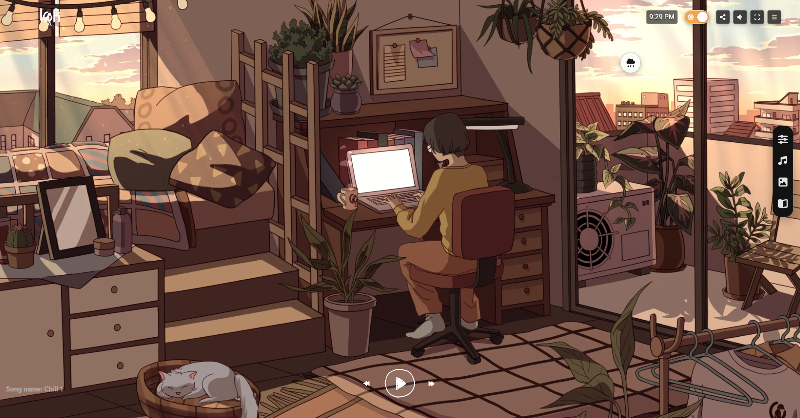
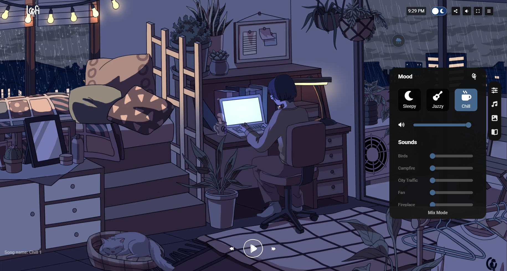

# Lofi Chill

Your calm, private corner of the web. Lofi Chill pairs local lofi playlists, ambient sounds, and animated day/night scenes to create a focused space for studying, working, reading, or simply slowing down.

Everything runs locally in the browser—no account, no hosted Render API, and no waiting for a remote media server.

| A calm sunny workspace | Rainy-night focus mode |
| --- | --- |
|  |  |

## Highlights

- Four local background videos: sunny day, rainy day, clear night, and rainy night.
- Curated Chill, Jazzy, and Sleepy lofi playlists.
- Mixable ambient sounds with independent volume controls.
- Light and dark scenes with a theme-aware interface.
- Rain toggle, music controls, fullscreen support, and a compact floating control panel.
- Fast Vite-powered development and production builds.

## Run locally

Prerequisites: Node.js 20.19+ or 22.12+.

From the repository root:

```bash
npm install
npm start
```

Then open the local URL printed by Vite (normally `http://localhost:5173`).

To work directly inside the frontend folder:

```bash
cd frontend
npm install
npm run dev
```

## Commands

| Command | Description |
| --- | --- |
| `npm start` | Start the Vite development server. |
| `npm run build` | Create an optimized production bundle in `frontend/dist/`. |
| `npm test` | Run the Vitest unit tests. |
| `npm run test:coverage` | Run tests with coverage reporting. |
| `npm run test:e2e` | Run the Playwright end-to-end test suite. |

The same commands are available from `frontend/`; use `npm run dev` there to start the development server.

## Local media

Media is intentionally served from `frontend/public/` so the experience works without a backend:

- `frontend/public/video/` contains the scene videos.
- `frontend/public/lofi/` contains the music playlists.
- `frontend/public/musics/` contains ambient sound loops.

Replace these files with your own properly licensed media to personalize the room.

## Built with

React, Vite, Redux Toolkit, Material UI, Sass, Vitest, and Playwright.
